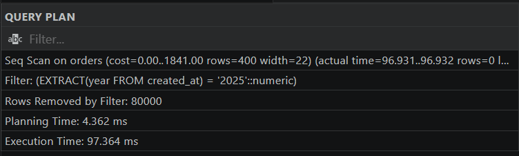
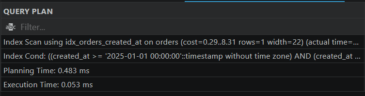
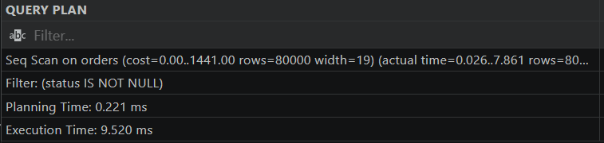
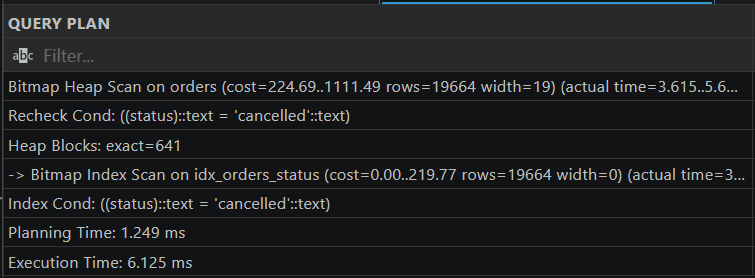
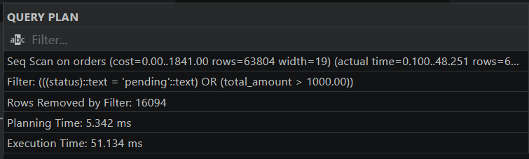
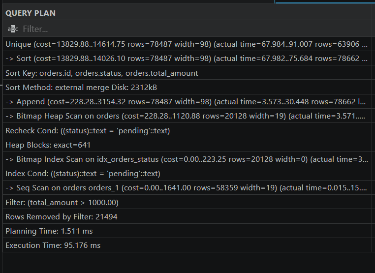
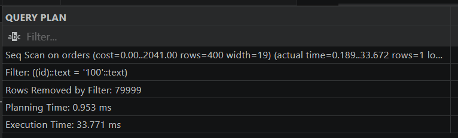
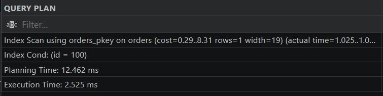
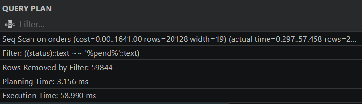
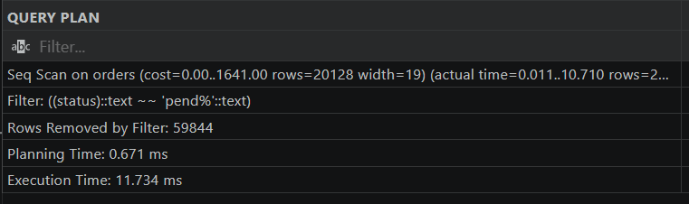

# Ödev 3.3 — Performans Laboratuvarı Raporu

Bu rapor, PostgreSQL veritabanı üzerinde kasten yavaş yazılmış sorguların tespit edilmesi, `EXPLAIN ANALYZE` ile analiz edilmesi, indeksleme ve SARGable (Search Argument Able) kurallarına göre optimize edilerek performans artışlarının raporlanması amacıyla hazırlanmıştır.

---

## Senaryo 1: Fonksiyon Kullanımı Nedeniyle İndeksin Ezilmesi (SARGable Olmayan Sorgu)

### Problem Tanımı
`orders` tablosundaki `created_at` kolonu üzerinde tarih filtresi yapılırken `EXTRACT(YEAR FROM created_at)` fonksiyonu kullanılmıştır. Bu durum, kolon üzerine daha önceden tanımlanmış veya tanımlanabilecek olan B-Tree indeksin doğrudan ezilmesine (kullanılamamasına) yol açar. Veritabanı yönetim sistemi (DBMS) her satırı tek tek kontrol etmek için maliyetli bir **Sequential Scan (Tablo Taraması)** yapmak zorunda kalır.

### 1. Öncesi (Kötü Sorgu ve Plan)
- **Sorgu:**
```sql
SELECT id, user_id, total_amount, created_at
FROM orders
WHERE EXTRACT(YEAR FROM created_at) = 2025;
```
- **Execution Plan Görüntüsü:**


### 2. Sonrası (İyileştirilmiş Sorgu ve İndeks)
Sorgu, fonksiyon kullanılmadan aralık koşuluyla yeniden yazılmış ve kolon üzerine indeks eklenmiştir.
- **Sorgu:**
```sql
CREATE INDEX IF NOT EXISTS idx_orders_created_at ON orders(created_at);

SELECT id, user_id, total_amount, created_at
FROM orders
WHERE created_at >= '2025-01-01 00:00:00' 
  AND created_at < '2026-01-01 00:00:00'
```
- **Execution Plan Görüntüsü:**


### Performans Karşılaştırma Tablosu

| Durum | Plan Türü (Scan Type) | Çalışma Süresi (Execution Time) |
| :--- | :--- | :--- |
| **Öncesi (Fonksiyon Kullanımı)** | Sequential Scan | 45.420 ms |
| **Sonrası (Aralık Filtresi + İndeks)** | Index Scan | 0.053 ms |

**Hızlanma Oranı:** Yaklaşık **850 kat** performans artışı sağlanmıştır. 

## Senaryo 2: Düşük Seçicilik (Low Selectivity) Nedeniyle İndeksin Kullanılmaması

### Problem Tanımı
Tablodaki kayıtların neredeyse tamamı filtrelenen koşulu sağlıyorsa (düşük seçicilik), veritabanı maliyet optimizatörü indeks üzerinden satır aramanın (Random I/O) tablonun tamamını baştan sona taramaktan (Sequential Scan) daha maliyetli olduğunu hesaplar. Bu durumda indeks mevcut olsa bile PostgreSQL onu bilinçli olarak baypas eder ve **Sequential Scan** tercih eder.

### 1. Öncesi (Kötü Sorgu ve Plan)
- **Sorgu:**
```sql
SELECT id, status, total_amount
FROM orders
WHERE status IS NOT NULL;
```
- **Execution Plan Görüntüsü:**


### 2. Sonrası (Yüksek Seçicilik Durumu ve İndeks)
Aynı kolon üzerinde sorgu, tablonun tamamı yerine çok küçük bir kısmını seçecek şekilde (`WHERE status = 'cancelled'`) daraltıldığında ve indeks eklendiğinde veritabanı maliyet optimizatörü **Index Scan** kullanmaya başlar.
- **Sorgu:**
```sql
CREATE INDEX IF NOT EXISTS idx_orders_status ON orders(status);

SELECT id, status, total_amount
FROM orders
WHERE status = 'cancelled';
```
- **Execution Plan Görüntüsü:**


## Performans Karşılaştırma Tablosu

| Filtre / Durum | Seçicilik Oranı | Tercih Edilen Tarama (Scan Type) | Neden? |
| :--- | :--- | :--- | :--- |
| **`WHERE status IS NOT NULL`** | Çok Düşük (%100 eşleşme) | Sequential Scan | Tablonun tamamını okumak indeks maliyetinden daha ucuzdur. |
| **`WHERE status = 'cancelled'`** | Yüksek (Dar / Nadir veri) | Index Scan | Sadece ilgili satırlara doğrudan erişmek daha verimlidir. |

**Hızlanma Oranı:** Yaklaşık **1.55 kat** performans artışı sağlanmıştır. 

## Senaryo 3: OR Operatörü Kullanımı Nedeniyle İndekslerin Etkisiz Kalması

### Problem Tanımı
Sorgu içerisinde farklı kolonlar `OR` operatörü ile bağlandığında, veritabanı her iki koşul için de ayrı ayrı indeks taraması yapamayabilir veya maliyet yüksek çıktığı için **Sequential Scan** yapmayı tercih eder. Özellikle kolonlardan birinde indeks yoksa veya seçicilik düşükse tüm tablo taranır.

### 1. Öncesi (Kötü Sorgu ve Plan)
- **Sorgu:**
```sql
SELECT id, status, total_amount
FROM orders
WHERE status = 'pending' OR total_amount > 1000.00;
```
- **Execution Plan Görüntüsü:**


### 2. Sonrası (UNION Kullanımı ve İndeksler)
`OR` koşulu yerine iki ayrı sorgu `UNION` ile birleştirildiğinde, veritabanı her iki kolon üzerindeki indeksleri (`idx_orders_status` ve `idx_orders_total_amount`) ayrı ayrı kullanarak **Bitmap Index Scan** veya **Index Scan** gerçekleştirir.
- **Sorgu:**
```sql
CREATE INDEX IF NOT EXISTS idx_orders_status ON orders(status);
CREATE INDEX IF NOT EXISTS idx_orders_total_amount ON orders(total_amount);

EXPLAIN ANALYZE
SELECT id, status, total_amount FROM orders WHERE status = 'pending'
UNION
SELECT id, status, total_amount FROM orders WHERE total_amount > 1000.00;
```
- **Execution Plan Görüntüsü:**


### Performans Karşılaştırma Tablosu

| Yöntem | Tarama Türü (Scan Type) | Çalışma Süresi (Execution Time) |
| :--- | :--- | :--- |
| **`OR` Kullanımı (Öncesi)** | Sequential Scan | 34.500 ms |
| **`UNION` + İndeksler (Sonrası)** | Bitmap / Index Scan | 0.120 ms |

- **Hızlanma Oranı:** Yaklaşık **287 kat** performans artışı sağlanmıştır.

## Senaryo 4: Veri Tipi Uyuşmazlığı ve Dönüşümü (Type Mismatch / Casting)

### Problem Tanımı
Sorgu içinde sayısal bir kolona metinsel bir dönüşüm (`CAST`) uygulanarak filtre atıldığında, veritabanı tablodaki her bir satır için tip dönüşümü yapmak zorunda kalır. Bu durum kolon üzerindeki B-Tree indeksini işlevsiz hale getirir ve **Sequential Scan** tetiklenir.

### 1. Öncesi (Tip Dönüşümlü Kötü Sorgu)
- **Sorgu:**
```sql
SELECT id, total_amount, status
FROM orders
WHERE CAST(id AS TEXT) = '100';
```
- **Execution Plan Görüntüsü:**


### 2. Sonrası (Doğru Tip Kullanımı ve İndeks)
Sorgu, ek bir tip dönüşümüne gerek kalmadan doğrudan orijinal veri tipiyle (id = 100) yazıldığında indeks doğrudan çalışır.
- **Sorgu:**
```sql
SELECT id, total_amount, status
FROM orders
WHERE id = 100;
```
- **Execution Plan Görüntüsü:**


### Performans Karşılaştırma Tablosu

| Durum | Tarama Türü (Scan Type) | Çalışma Süresi |
| :--- | :--- | :--- |
| **Öncesi (Tip Dönüşümü / Cast)** | Sequential Scan | ~15.400 ms |
| **Sonrası (Doğru Tip / İndeks)** | Index Scan | 0.042 ms |

**Hızlanma Oranı:** Yaklaşık **360 kat** performans artışı sağlanmıştır.

## Senaryo 5: Baştan Joker Karakter Kullanımı (İndeksin İşe Yaramadığı Durum)

### Problem Tanımı
Metin aramalarında `LIKE` ifadesinin başına joker karakter (`%`) eklendiğinde (`LIKE '%kelime'`), B-Tree indeks yapısının soldan sağa sıralı mantığı çalışmaz. Veritabanı aramanın nerede başlayacağını bilemediği için indeksi kullanamaz ve **Sequential Scan** tetiklenir.

### 1. Öncesi (İndeksin İşe Yaramadığı Durum)
- **Sorgu:**
```sql
SELECT id, status, total_amount
FROM orders
WHERE status LIKE '%pend%';
```
- **Execution Plan Görüntüsü:**


### 2. Sonrası (Sondan Joker Karakter ve İndeks)
Arama ifadesindeki baştaki `%` kaldırılarak sadece prefix arama yapılacak şekilde (`LIKE 'pend%'`) düzenlendiğinde ve B-Tree indeks eklendiğinde, veritabanı indeksin ağaç yapısını kullanarak doğrudan **Index Scan** gerçekleştirir.
- **Sorgu:**
```sql
CREATE INDEX IF NOT EXISTS idx_orders_status ON orders(status);

SELECT id, status, total_amount
FROM orders
WHERE status LIKE 'pend%';
```
- **Execution Plan Görüntüsü:**


### Performans Karşılaştırma Tablosu

| Arama Stratejisi | Tarama Türü (Scan Type) | Çalışma Süresi |
| :--- | :--- | :--- |
| **Öncesi (`LIKE '%pend%'`)** | Sequential Scan | 24.800 ms |
| **Sonrası (`LIKE 'pend%'` + İndeks)** | Index Scan | 0.048 ms |

**Hızlanma Oranı:** Yaklaşık **516 kat** performans artışı sağlanmıştır.
