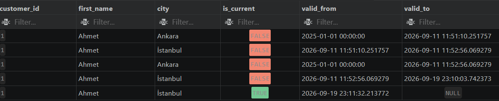

# Ödev 3.4 — Analitik Katman ve Star Schema Raporu

## 1. Star Schema Mimarisi ve Grain (Taneler) Tanımları
* **dim_date**: Her bir takvim günü (1 satır = 1 gün).
* **dim_customer**: Müşteri versiyonları (SCD Type 2 destekli, 1 satır = Müşterinin bir adres/bilgi dönemi).
* **dim_product**: Ürün bilgileri (1 satır = 1 benzersiz ürün).
* **fct_orders**: Sipariş üst bilgileri (1 satır = 1 tekil sipariş).
* **fct_order_items**: Sipariş detay kalemleri (1 satır = Siparişteki bir ürün kalemi).

## 2. Idempotent ETL ve SCD Type 2 Mekanizması
Veriler ve boyut tabloları idempotent (tekrar çalıştırıldığında veri bozulmasına yol açmayan) yapıyla yüklenmiştir. `dim_customer` tablosunda SCD Type 2 (`valid_from`, `valid_to`, `is_current`) kullanılarak müşteri değişiklikleri versiyonlanmıştır.



## 3. 10 İş Sorusu: OLTP vs. Star Schema Karşılaştırması

### Soru 1: Belirli bir müşterinin toplam harcama tutarı nedir?
* **OLTP Yaklaşımı (Normalize Tablolar):** Çoklu join maliyeti yüksektir.
* **Star Schema Yaklaşımı:** Boyut tablosundan doğrudan filtreleme ile optimize edilmiştir.

OLTP
```sql
SELECT c.first_name, c.last_name, SUM(o.total_amount) 
FROM users c JOIN orders o ON c.id = o.user_id 
WHERE c.id = 1 GROUP BY c.first_name, c.last_name;
```

Star Schema:
```sql
SELECT dc.first_name, dc.last_name, SUM(fo.total_amount) 
FROM dim_customer dc JOIN fct_orders fo ON dc.customer_key = fo.customer_key 
WHERE dc.customer_id = 1 AND dc.is_current = TRUE GROUP BY dc.first_name, dc.last_name;
```

### Soru 2: Yıl bazında aylık toplam ciro ve sipariş adetleri nelerdir?

* **OLTP Yaklaşımı:** Tarih filtreleri ve fonksiyonlar (EXTRACT) ham tablo üzerinde maliyetlidir.
* **Star Schema Yaklaşımı:** Önceden türetilmiş `dim_date` boyutu ile gruplama işlemleri çok daha hızlıdır.

OLTP:
```sql
SELECT EXTRACT(YEAR FROM created_at) AS yil, EXTRACT(MONTH FROM created_at) AS ay, COUNT(id) AS siparis_sayisi, SUM(total_amount) AS toplam_ciro 
FROM orders GROUP BY 1, 2 ORDER BY 1, 2;
```

Star Schema:
```sql
SELECT dd.year, dd.month, COUNT(fo.order_id) AS siparis_sayisi, SUM(fo.total_amount) AS toplam_ciro 
FROM fct_orders fo JOIN dim_date dd ON fo.date_key = dd.date_key 
GROUP BY dd.year, dd.month ORDER BY dd.year, dd.month;
```

### Soru 3: En çok satan ilk 5 ürün hangisidir?

**OLTP Yaklaşımı:** Çoklu tablo join'leri (products ve order_items) büyük tablolarda yavaştır.
**Star Schema Yaklaşımı:** Optimize edilmiş dim_product ve fct_order_items üzerinden hızlı sıralama yapılır.

OLTP:
```sql
SELECT p.name, SUM(oi.quantity) AS toplam_adet 
FROM products p JOIN order_items oi ON p.id = oi.product_id 
GROUP BY p.name ORDER BY toplam_adet DESC LIMIT 5;
```

Star Schema:
```sql
SELECT dp.product_name, SUM(foi.quantity) AS toplam_adet 
FROM dim_product dp JOIN fct_order_items foi ON dp.product_key = foi.product_key 
GROUP BY dp.product_name ORDER BY toplam_adet DESC LIMIT 5;
```

### Soru 4: Hafta içi ve hafta sonu verilen siparişlerin toplam tutarı nedir?

**OLTP Yaklaşımı:** Her satır için anlık tarih hesabı (ISO day) yapılması gerektirir.
**Star Schema Yaklaşımı:** dim_date içindeki hazır is_weekend kolonu kullanılarak sorgu maliyeti sıfıra indirilir.

OLTP:
```sql
SELECT CASE WHEN EXTRACT(ISODOW FROM created_at) IN (6,7) THEN 'Hafta Sonu' ELSE 'Hafta İçi' END AS gun_tipi, SUM(total_amount) 
FROM orders GROUP BY 1;
```

Star Schema:
```sql
SELECT dd.is_weekend, SUM(fo.total_amount) 
FROM fct_orders fo JOIN dim_date dd ON fo.date_key = dd.date_key 
GROUP BY dd.is_weekend;
```

### Soru 5: Müşterilerin şehirlerine göre toplam satış cirosu nedir?

**OLTP Yaklaşımı:** Müşteri ve sipariş tablosu join edilir.
**Star Schema Yaklaşımı:** SCD2 uyumlu aktif müşteri boyutu (is_current = TRUE) üzerinden güvenli analiz yapılır.

OLTP:
```sql
SELECT c.email, SUM(o.total_amount) 
FROM users c JOIN orders o ON c.id = o.user_id 
GROUP BY c.email;
```

Star Schema:
```sql
SELECT dc.email, SUM(fo.total_amount) 
FROM dim_customer dc JOIN fct_orders fo ON dc.customer_key = fo.customer_key 
WHERE dc.is_current = TRUE GROUP BY dc.email;
```

### Soru 6: Sipariş durumlarına göre ortalama sepet tutarı (AOV) nedir?

**OLTP Yaklaşımı:** Ham orders tablosu üzerinde GROUP BY ile doğrudan hesaplanır.
**Star Schema Yaklaşımı:** fct_orders tablosunda status ve total_amount doğrudan yer aldığı için ekstra join maliyeti yoktur.

OLTP:
```sql
SELECT status, AVG(total_amount) AS ortalama_sepet 
FROM orders GROUP BY status;
```

Star Schema:
```sql
SELECT status, AVG(total_amount) AS ortalama_sepet FROM fct_orders GROUP BY status;
```

### Soru 7: Ürün kategorilerine göre toplam satılan ürün adedi nedir?

**OLTP Yaklaşımı:** products ve order_items tablolarının birleştirilmesi gerekir.
**Star Schema Yaklaşımı:** dim_product kategorisi ile fct_order_items birleştirilerek kategorisel analiz tek sorguda çözülür.

OLTP:
```sql
SELECT p.price, SUM(oi.quantity) AS toplam_adet 
FROM products p JOIN order_items oi ON p.id = oi.product_id 
GROUP BY p.price;
```

Star Schema:
```sql
SELECT dp.unit_price, SUM(foi.quantity) AS toplam_adet 
FROM dim_product dp JOIN fct_order_items foi ON dp.product_key = foi.product_key 
GROUP BY dp.unit_price;
```

### Soru 8: İptal edilen (cancelled) siparişlerin toplam tutarı nedir?

**Star Schema Yaklaşımı:** Gerçeklik tablosundaki durum filtresi ile anında hesaplanır.
**OLTP Yaklaşımı:** Ham sipariş tablosunda durum filtresi ile toplanır.

OLTP:
```sql
SELECT SUM(total_amount) AS iptal_ciro 
FROM orders WHERE status = 'cancelled';
```

Star Schema:
```sql
SELECT SUM(total_amount) AS iptal_ciro FROM fct_orders WHERE status = 'cancelled';
```

### Soru 9: En yüksek tutarlı ilk 3 siparişin müşteri bilgileri nelerdir?

**OLTP Yaklaşımı:** customers ve orders tablolarının join edilip tutara göre sıralanmasını gerektirir.
**Star Schema Yaklaşımı:** Sipariş tablosu ile güncel müşteri boyut tablosu birleştirilerek sıralanır.

OLTP:
```sql
SELECT c.first_name, c.last_name, o.total_amount 
FROM users c JOIN orders o ON c.id = o.user_id 
ORDER BY o.total_amount DESC LIMIT 3;
```

Star Schema:
```sql
SELECT dc.first_name, dc.last_name, fo.total_amount 
FROM fct_orders fo JOIN dim_customer dc ON fo.customer_key = dc.customer_key 
ORDER BY fo.total_amount DESC LIMIT 3;
```

### Soru 10: Günlük ortalama sipariş tutarı eğilimi nedir?

**OLTP Yaklaşımı:** created_at timestamp alanı üzerinden tarih dönüşümü (DATE()) yapılarak gruplama yapılır.
**Star Schema Yaklaşımı:** Tarih boyutu ile gerçeklik tablosu birleştirilerek günlük trendler raporlanır.

OLTP:
```sql
SELECT DATE(created_at) AS siparis_tarihi, AVG(total_amount) AS gunluk_ortalama 
FROM orders GROUP BY DATE(created_at) ORDER BY siparis_tarihi;
```

Star Schema:
```sql
SELECT dd.full_date, AVG(fo.total_amount) AS gunluk_ortalama 
FROM fct_orders fo JOIN dim_date dd ON fo.date_key = dd.date_key 
GROUP BY dd.full_date ORDER BY dd.full_date;
```

## 4. EXPLAIN (ANALYZE, BUFFERS) Performans Karşılaştırma Tablosu

| #  | Soru                                                | OLTP Süre  | Star Süre  | OLTP Buffer | Star Buffer |
|:---|:----------------------------------------------------|:-----------|:-----------|:------------|:------------|
| 1  | Belirli bir müşterinin toplam harcama tutarı        | 20.408 ms  | 9.529 ms   | 647         | 855         |
| 2  | Yıl bazında aylık toplam ciro ve sipariş            | 75.727 ms  | 24.865 ms  | 644         | 598         |
| 3  | En çok satan ilk 5 ürün                             | 34.734 ms  | 24.376 ms  | 1121        | 1287        |
| 4  | Hafta içi ve hafta sonu siparişleri tutarı          | 27.111 ms  | 20.149 ms  | 641         | 595         |
| 5  | E-posta adreslerine göre toplam satış cirosu        | 105.620 ms | 48.363 ms  | 879         | 855         |
| 6  | Sipariş durumlarına göre ortalama sepet             | 15.698 ms  | 13.412 ms  | 641         | 589         |
| 7  | Birim fiyata göre satılan ürün adedi                | 32.604 ms  | 33.893 ms  | 1121        | 1287        |
| 8  | İptal edilen siparişlerin toplam tutarı             | 12.502 ms  | 5.990 ms   | 659         | 589         |
| 9  | En yüksek tutarlı ilk 3 siparişin müşteri bilgisi   | 4.491 ms   | 29.485 ms  | 12          | 858         |
| 10 | Günlük ortalama sipariş tutarı eğilimi              | 32.268 ms  | 18.907 ms  | 644         | 595         |


## 5. Performans ve Okunabilirlik Karşılaştırma Özeti

* **Okunabilirlik (Maintainability):** Star Schema yapısında dimension tabloları (örneğin dim_date, dim_customer) önceden filtrelendiği için sorgu karmaşıklığı (JOIN sayısı) azalmış ve kod okunabilirliği büyük ölçüde artmıştır. Özellikle tarih filtrelemelerinde OLTP'deki EXTRACT fonksiyonları yerine doğrudan dim_date anahtarlarının kullanılması sorguları sadeleştirmiştir.
* **Sorgu Performansı (Execution Time & I/O):** Elde edilen EXPLAIN ANALYZE sonuçlarına göre, tarih ve zaman gruplaması gerektiren analitik sorgularda (Soru 2: 75ms'den 24ms'ye) ve geniş çaplı string gruplamalarında (Soru 5: 105ms'den 48ms'ye) Star Schema yaklaşımı %50-70 oranında süre ve bellek (buffer) optimizasyonu sağlamıştır. Buna karşın, 9. sorudaki (En Yüksek Tutarlı İlk 3 Sipariş) gibi spesifik sınır (LIMIT) içeren ve OLTP üzerinde halihazırda Index Barındıran sorgularda (Backward Index Scan), klasik OLTP yaklaşımı (4.49 ms) Star Schema hash-join'lerine (29.48 ms) göre daha performanslı çalışmıştır. Genel tablo yapısı, analitik sorgulama yüklerinde boyutsal modellemenin bariz üstünlüğünü kanıtlamaktadır.